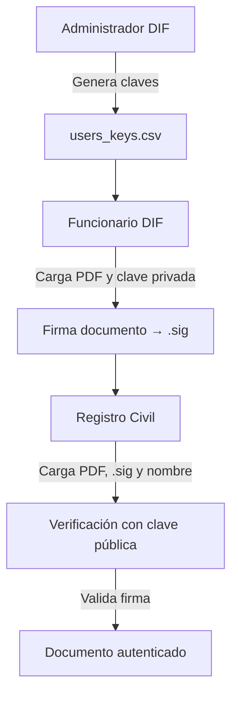

# 📄 Firma Digital de Documentos PDF — DIF

Este proyecto implementa un sistema de **firma digital con criptografía RSA** sobre archivos PDF, pensado para su uso en el contexto del **DIF (Desarrollo Integral de la Familia)**. Su objetivo es asegurar la **autenticidad** e **integridad** de documentos generados por funcionarios del DIF y validados por personal del Registro Civil.

---

## ⚙️ ¿Cómo funciona?

El flujo de trabajo está dividido en tres roles funcionales, cada uno representado por un archivo `.py` en la carpeta `/pages`:

### 🔐 1. Generación de llaves (`dif_admin.py`)
El administrador del DIF:
- Ingresa el nombre del funcionario.
- Genera un par de llaves RSA de 2048 bits (clave pública y privada).
- Guarda la clave pública y el módulo en el archivo `users_keys.csv`.
- Comparte **privadamente** la clave privada al funcionario para firmar documentos.

> 🔑 El archivo `users_keys.csv` actúa como un registro oficial de firmas válidas.

---

### 🖋️ 2. Firma de documentos (`dif.py`)
El funcionario del DIF:
- Carga un archivo PDF.
- Ingresa su clave privada.
- El sistema:
  - Extrae el texto del PDF con `PyPDF2`.
  - Genera un hash SHA-256 del contenido.
  - Firma el hash utilizando la clave privada (`firma = hash^d mod N`).
- Se genera un archivo `.sig` con la firma digital.

---

### 🧾 3. Verificación (`rc.py`)
El funcionario del Registro Civil:
- Carga un archivo PDF y su correspondiente `.sig`.
- Ingresa el nombre del firmante.
- El sistema:
  - Busca la clave pública y el módulo en `users_keys.csv`.
  - Genera el hash del documento.
  - Verifica la firma aplicando la clave pública (`firma^e mod N`) y comparando con el hash original.
- Muestra si la firma es válida o no.

---

## 🗂️ Estructura del repositorio

```
📁 .streamlit/
    └── config.toml             # Configuración del layout de Streamlit

📁 pages/
    ├── dif.py                  # Interfaz de firma para funcionarios del DIF
    ├── dif_admin.py            # Administración: generación de llaves
    ├── rc.py                   # Verificación para el Registro Civil

📄 ejemplo.pdf                 # PDF de ejemplo para pruebas
📄 clave_privada_menganito.pem # Llave privada de ejemplo para pruebas
📄 functions.py                # Funciones de la interfaz e interacción con el usuario
📄 key_functions.py            # Funciones relacionadas a RSA, hash y firma
📄 main.py                     # Interfaz principal de la app (inicio)
📄 requirements.txt            # Librerías de python requeridas para que la interfaz funcione
📄 users_keys.csv              # Registro de claves públicas de los usuarios
📄 README.md                   # Este documento
📄 LICENSE                     # Licencia del proyecto
```


---

## 🔄 Diagrama del flujo de trabajo



# 🔐 Seguridad
Las claves privadas nunca se almacenan, solo se muestran para su descarga inmediata.

El archivo `users_keys.csv` contiene solo información pública (clave pública y módulo).

Se recomienda proteger la clave privada del funcionario (por ejemplo, entregándola mediante un canal seguro o usando encriptación adicional).

# 🧪 Tecnologías utilizadas
* `Python 3.10+`

* `Streamlit` – interfaz de usuario

* `PyPDF2` – extracción de texto de PDF

* `hashlib` – generación de hash SHA-256

* `pandas` – almacenamiento simple de claves públicas

* `cryptography` - generación de llaves RSA

* `base64` – codificación/decodificación de firmas

# ▶️ Cómo ejecutar el proyecto

1. Clona el repositorio:

```
git clone https://github.com/santiagomora2/firma_digital_dif.git
cd firma-dif
```

2. Instala los requerimientos

```
pip install -r requirements.txt
```

3. Ejecuta la app
```
python -m streamlit run main.py
```

# ⚗️ Pruebas

Como ejemplo, se agregó al funcionario 'Menganito' en el CSV, así como su clave privada. Esto a modo de hacer pruebas con el archivo `ejemplo.pdf`.

# ✍️ Autores
* Santiago Mora Cruz
* Gabriel Reynoso Escamilla
* Guillermo Villegas Morales

Estudiantes de Ingeniería en Ciencia de Datos y Matemáticas
